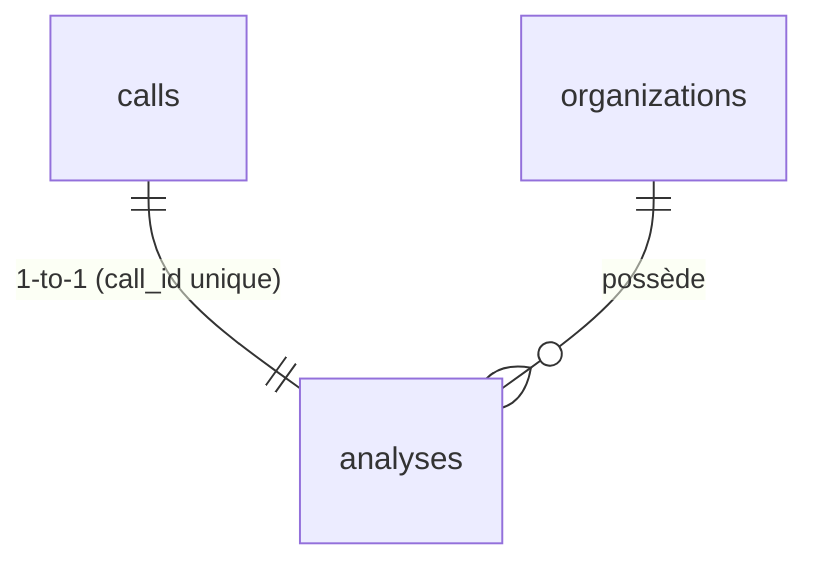

↑ [[Carte-globale]]

# 🗄️ Table `analyses`

Le **résultat de l'IA** pour un appel : scores, points forts/faibles, conseils,
tâches de suivi. **Une seule analyse par appel** (contrainte `unique` sur `call_id`).

[[Base-calls|→ calls]] · [[Base-organizations|→ organizations]]

## Colonnes

| Colonne | Type | Rôle |
|---|---|---|
| `id` | uuid (PK) | Identifiant de l'analyse. |
| `call_id` | uuid (FK, **unique**) | L'appel analysé. |
| `organization_id` | uuid (FK) | L'org (multi-tenant). |
| `score_global` | int 0-100 | Score d'ensemble. |
| `score_discovery` | int 0-100 | Découverte des besoins. |
| `score_qualification` | int 0-100 | Qualification. |
| `score_objection_handling` | int 0-100 | Gestion des objections. |
| `score_closing` | int 0-100 | Closing. |
| `score_next_step` | int 0-100 | Prochaine étape engagée. |
| `summary` | text | Résumé de l'appel. |
| `strengths` | jsonb | Points forts `[{ point, citation }]`. |
| `weaknesses` | jsonb | Axes d'amélioration. |
| `coaching_advice` | jsonb | Conseils `[{ advice, priority }]`. |
| `followup_points` | jsonb | Points à mettre dans l'email de suivi. |
| `suggested_tasks` | jsonb | Tâches datées proposées (poussées vers HubSpot). |
| `conversation_metrics` | jsonb | Métriques déterministes (temps de parole, etc.) — calcul sans IA. |
| `dimensions` | jsonb | Scoring factuel par dimensions (V2 pilotage). |
| `behavioral_signals` | jsonb | Signaux comportementaux détectés. |
| `used_ai_profile` | bool | L'analyse a-t-elle utilisé le profil IA de l'org ? |
| `model_used` | text | `claude-haiku-4-5-20251001`. |
| `cost_eur` | numeric | Coût **estimé** de l'analyse. |
| `created_at` | timestamptz | Horodatage. |

## Qui écrit / lit

- **Écrit** : `/api/analyze` (un seul insert après l'appel à Claude) → [[Pipeline-appel]].
- **Lit** : le dashboard (page détail d'un appel) — scores + coaching.

> 💡 Le `score_global` est en cours de **dé-priorisation** (V2 J20→J25) au profit d'un
> scoring factuel par dimensions avec citations. La colonne reste pour compat.
