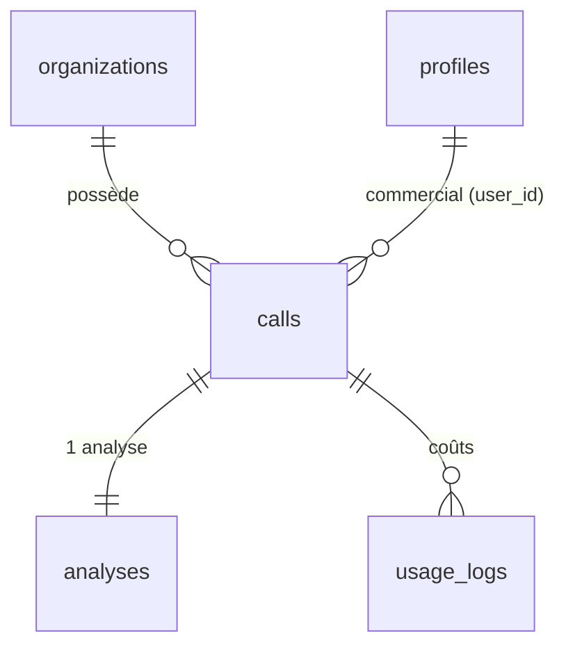

↑ [[Carte-globale]]

# 🗄️ Table `calls`

Le cœur du produit : **un appel téléphonique** et son avancement dans le pipeline.
Source de vérité du schéma : `supabase/migrations/`.

[[Base-organizations|→ organizations]] · [[Base-profiles|→ profiles]] · [[Base-analyses|→ analyses]] · [[Base-usage_logs|→ usage_logs]]

## Colonnes

| Colonne | Type | Rôle |
|---|---|---|
| `id` | uuid (PK) | Identifiant de l'appel. |
| `organization_id` | uuid (FK) | À quelle org appartient l'appel (multi-tenant). |
| `user_id` | uuid (FK) | Le commercial propriétaire (peut être null). |
| `provider` | text | `ringover` / `aircall` / `simulated`. |
| `provider_call_id` | text | Id côté Ringover — sert à l'**idempotence** (anti-doublon). |
| `callee_number` | text | Numéro appelé (sert au matching HubSpot). |
| `direction` | text | `inbound` / `outbound`. |
| `contact_name` | text | Nom du contact (enrichi par HubSpot ou simulateur). |
| `company_name` | text | Entreprise (enrichie HubSpot). |
| `deal_name` / `deal_id` | text | Affaire rattachée (regroupe plusieurs appels). |
| `duration_seconds` | int | Durée de l'appel. |
| `started_at` | timestamptz | Quand l'appel a eu lieu. |
| **`status`** | text | **Pipeline** : `pending → transcribing → transcribed → analyzing → analyzed` / `failed`. |
| `audio_url` | text | URL temporaire de l'enregistrement — **mise à `null` après transcription (RGPD)**. |
| `transcript_text` | text | Le texte transcrit. |
| `transcript_segments` | jsonb | Diarisation (qui parle quand). |
| `assemblyai_transcript_id` | text | Id AssemblyAI (le webhook retrouve l'appel via cette colonne indexée). |
| `hubspot_sync_status` | jsonb | Résultat de la synchro HubSpot (note + tâches poussées). |
| `error_message` | text | Détail si `status = failed`. |
| `created_at` / `updated_at` | timestamptz | Horodatage. |

## Sécurité (RLS)

- **RLS activée + forcée.** Les membres de l'org **lisent** leurs appels ; le serveur
  (service key) **écrit** via le pipeline. Voir [[Securite]].
- `external_id` et `contact_phone` ont été **supprimés** (migration 0020, colonnes mortes).

## Qui écrit / lit cette table

- **Écrit** : `/api/webhooks/ringover` (insert), `/api/transcribe`, `/api/webhooks/assemblyai`, `/api/analyze` → voir [[Pipeline-appel]].
- **Lit** : le [[Carte-globale|dashboard]] (`/dashboard/calls`).
