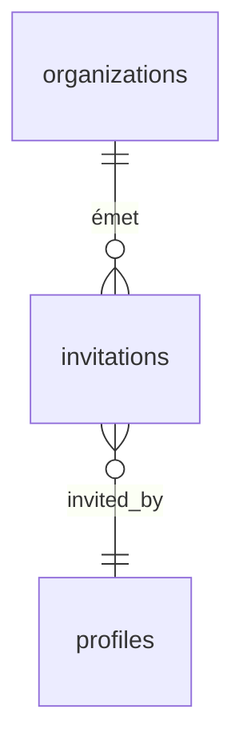
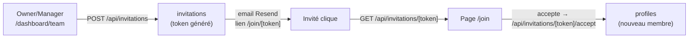

↑ [[Carte-globale]]

# 🗄️ Table `invitations`

Les **liens magiques** pour faire rejoindre un utilisateur à une org.

[[Base-organizations|→ organizations]] · [[Base-profiles|→ profiles]]

## Colonnes

| Colonne | Type | Rôle |
|---|---|---|
| `id` | uuid (PK) | Identifiant de l'invitation. |
| `organization_id` | uuid (FK) | Org qui invite. |
| `email` | text | Email invité. |
| `role` | text | Rôle attribué — à l'invitation : `manager` ou `sales` (un owner ne se réplique pas). |
| `invited_by` | uuid (FK) | Le profil qui a invité. |
| `token` | text (unique) | Hex 32 chars **sans tirets**, généré par la DB (pas un uuid). |
| `expires_at` | timestamptz | Expiration (7 jours par défaut). |
| `accepted_at` | timestamptz | Quand l'invité a accepté (null sinon). |
| `created_at` | timestamptz | Horodatage. |

## Le parcours d'invitation

> 💡 Sur le segment `[token]` : **GET** se fait par `token`, **DELETE** par `id`.
> C'est **volontaire**, pas une incohérence à « nettoyer ».

## Qui écrit / lit

- **Écrit** : `/api/invitations` (création), `/api/invitations/[token]/accept`.
- **Lit** : page `/join/[token]`, `/dashboard/team`.
