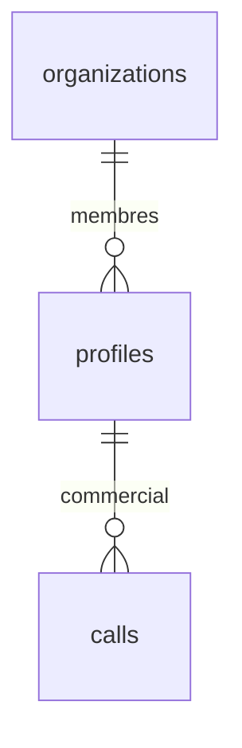
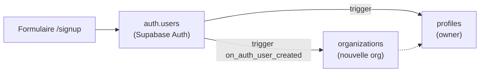

↑ [[Carte-globale]]

# 🗄️ Table `profiles`

Le **profil étendu d'un utilisateur**. Pont avec Supabase Auth : `profiles.id = auth.users.id`.

[[Base-organizations|→ organizations]] · [[Base-calls|→ calls]]

## Colonnes

| Colonne | Type | Rôle |
|---|---|---|
| `id` | uuid (PK) | = `auth.users.id` (1-to-1 avec l'auth Supabase). |
| `organization_id` | uuid (FK) | L'org à laquelle le user appartient. |
| `email` | text | Email. |
| `full_name` | text | Nom complet. |
| `role` | text | `owner` / `manager` / `sales`. |
| `avatar_url` | text | Avatar. |
| `removed_at` | timestamptz | Détaché de l'org (suppression RGPD 90j après cette date). |
| `created_at` / `updated_at` | timestamptz | Horodatage. |

## Le trigger de signup (important)

À chaque inscription dans `auth.users`, le trigger `on_auth_user_created`
(fonction `handle_new_user`) crée **automatiquement** :
1. une **organization** (nom depuis le formulaire de signup),
2. un **profile** `owner` lié à cette org.

## Détachement & RGPD

- `removed_at` : un membre retiré d'une org est **détaché** (pas supprimé direct).
- Un cron supprime définitivement les profils détachés **90 jours** après `removed_at`.

## Sécurité

- RLS forcée. Helper `public.user_organization_id()` (SECURITY DEFINER) évite la
  récursion dans les policies. Voir [[Securite]].
