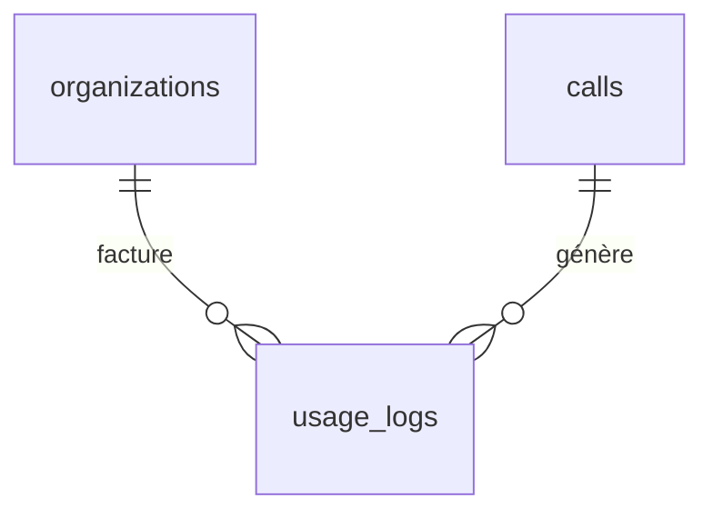

↑ [[Carte-globale]]

# 🗄️ Table `usage_logs`

Le **journal des coûts API** par organisation. Chaque opération payante
(transcription, analyse) y écrit une ligne. Sert au paywall et au suivi de dépense.

[[Base-organizations|→ organizations]] · [[Base-calls|→ calls]]

## Colonnes

| Colonne | Type | Rôle |
|---|---|---|
| `id` | uuid (PK) | Identifiant. |
| `organization_id` | uuid (FK) | Org facturée. |
| `call_id` | uuid (FK) | Appel concerné (peut être null). |
| `service` | text | `assemblyai` / `anthropic` / `resend` / `stripe` (liste fermée). |
| `operation` | text | `transcription`, `analysis`, `email`, etc. |
| `units` | numeric | Secondes audio ou tokens. |
| `cost_eur` | numeric | Coût **estimé** (pas une facture exacte). |
| `metadata` | jsonb | Détails (modèle, tokens, durée…). |
| `created_at` | timestamptz | Horodatage. |

> ⚠️ `service` n'accepte **que** ces 4 valeurs — pas de `system` possible (contrainte CHECK).

## ⚠️ Les coûts sont des ESTIMATIONS

Les `cost_eur` ici sont **calculés côté code**, ce ne sont pas les vraies factures
fournisseurs. La **seule** garantie qui stoppe la dépense, ce sont les **caps HARD**
dans les dashboards Anthropic (50 €/mois) et AssemblyAI (50 €/mois).

## Alerte de dépense (Edge Function `spend-alert`)

Une fonction Supabase somme `cost_eur` du jour et envoie un email Resend si ça dépasse
`SPEND_ALERT_DAILY_EUR` (défaut 10 €/jour). Alerte précoce, pas un plafond dur.

## Qui écrit / lit

- **Écrit** : `/api/transcribe` (coût transcription), `/api/webhooks/assemblyai`
  (coût réel), `/api/analyze` (coût tokens Claude). Voir [[Pipeline-appel]].
- **Lit** : le paywall (`lib/plans.ts`), l'Edge Function `spend-alert`, le dashboard.
